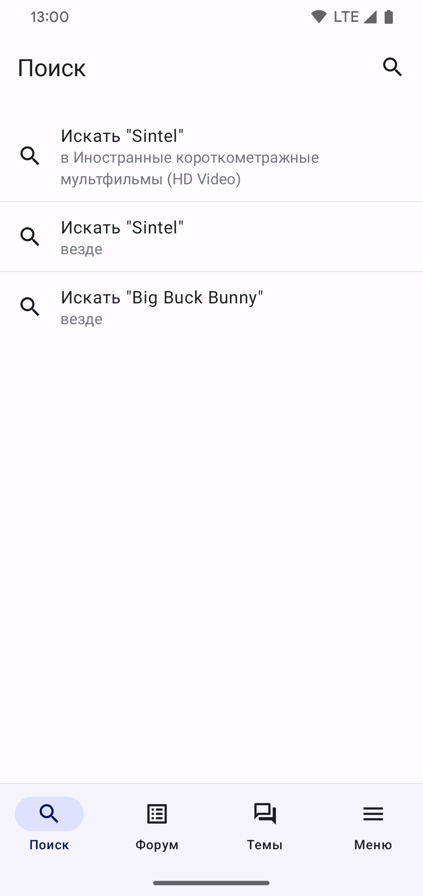
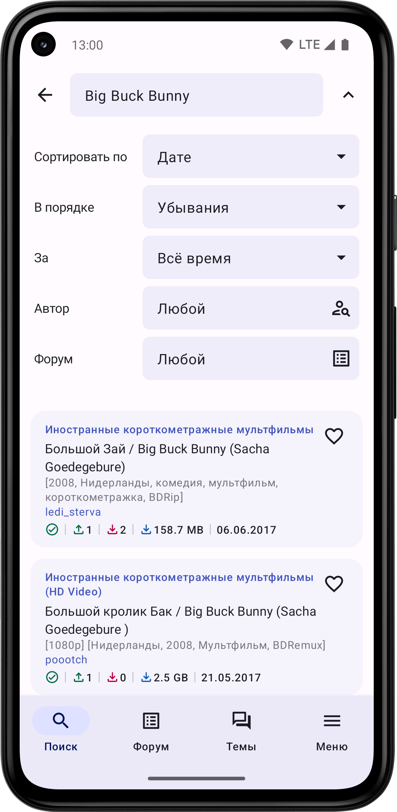
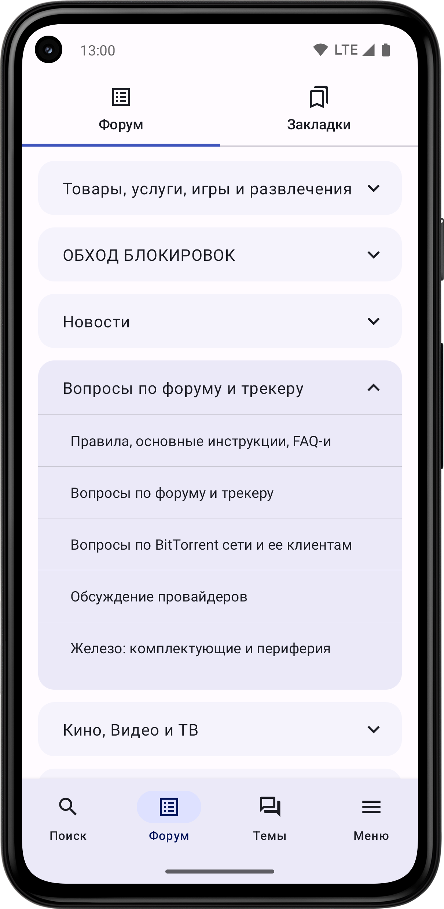
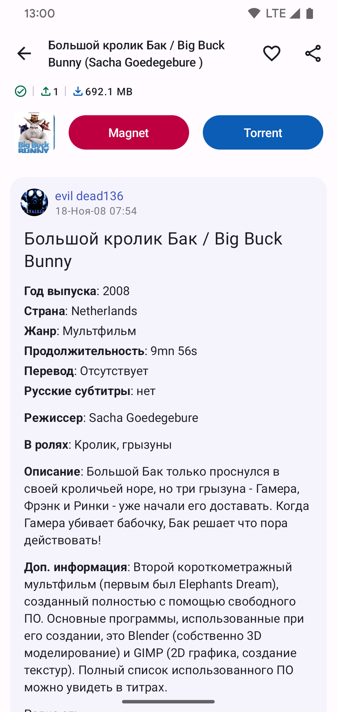
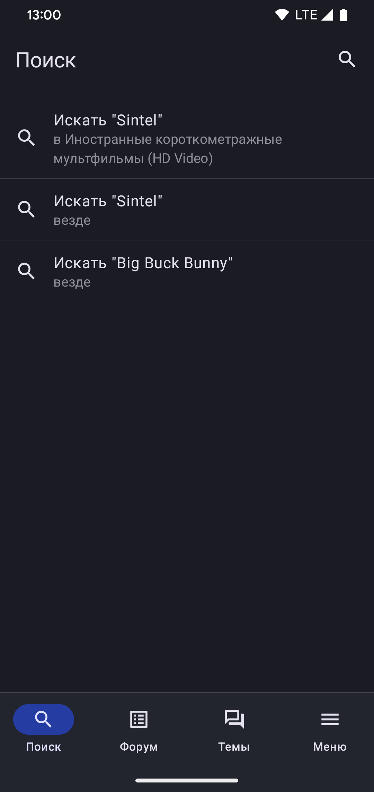
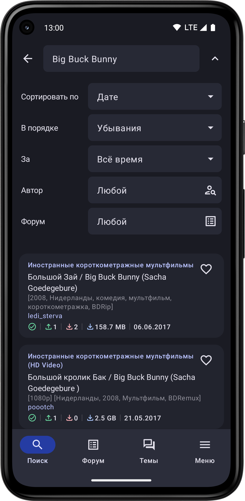
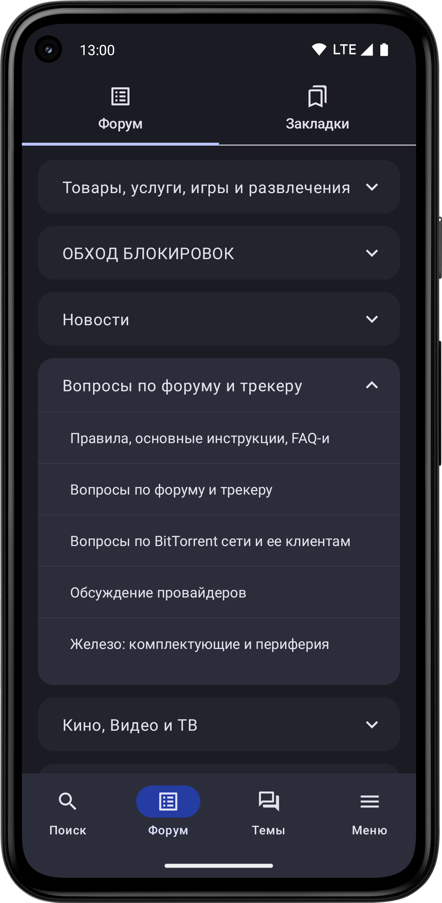

# Flow

Flow is an Android mobile app that is an unofficial client for the popular
Russian torrent tracker website – rutracker.org. With Flow, users can easily
search and download torrent files, manage their downloads, and stay up-to-date
with the latest forum posts and discussions on the site, all from their mobile
device.

Flow is designed to provide a fast, intuitive, and seamless user experience
for rutracker.org users on the go. The app is open source and free to use,
with no ads or tracking, and is constantly being updated and improved by
a small community of developers and contributors.

Disclaimer: Flow is not affiliated with or endorsed by rutracker.org in any way.
The app is provided for personal, non-commercial use only, and users are
responsible for complying with all applicable laws and regulations regarding
copyright and file sharing.

[**For copyright owners**][1]

## Mobile app

[][2]
[][3]

## Screenshots

    
Light

    
Dark

## Contact

Feel free to contact us if you found this useful or if there was something that
didn't behave as you expected. We can't fix what we don't know about, so please
report liberally. If you're not sure if something is a bug or not, feel free to
file a bug anyway.

**Issue tracker:** <https://github.com/andrikeev/Flow/issues>

**Forum 4PDA:** <https://4pda.to/forum/index.php?showtopic=729411>

## Sources

All the code and the content is available on github: <https://github.com/andrikeev/Flow>

## Privacy Policy

[Privacy Policy][4]

## License

This software is open source, licensed under the [MIT License][5].

[1]: proxy/src/main/resources/static/copyrights.html

[2]: https://github.com/andrikeev/Flow/releases

[3]: https://apps.rustore.ru/app/me.rutrackersearch.app

[4]: proxy/src/main/resources/static/privacy-policy.html

[5]: https://opensource.org/licenses/MIT 
